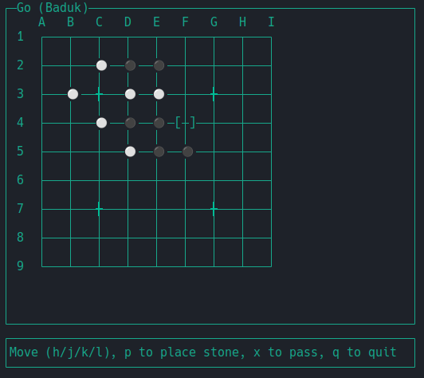

# GoInGo

The Game of Go written in Go

## Features

* Play against a computer opponent
* Play against another human
* Keybindings can be remapped
  * defaults to (vim-style):
    * `h` - left
    * `j` - down
    * `k` - up
    * `l` - right
    * `x` - pass turn
    * `q` - quit
    * `ẁ` - save game
    * `p` - place stone
  * If you hold `Shift` while navigating, the cursor jumps over occupied intersections
  to the next empty one.
  * these can be changed in the `config.json` file
* only supports 9x9 boards
* the GUI is terminal-based

## Rules

### 1. Players & Board

Two players (Black and White) take turns placing stones
on the intersections of a 19×19 grid (smaller boards like 13×13 or 9×9 are
also common).

### 2. Order of Play

Black plays first (unless a handicap is given).

### 3. Placing Stones

Players place one stone per turn on any vacant
intersection, except where forbidden by the rules.

### 4. Liberty Rule

Every stone or connected group (chain) must have at least
one open adjacent point (liberty). Stones or groups with no liberties are
captured and removed from the board.

### 5. Ko Rule (Repetition Rule)

Players cannot make a move that would
recreate the exact board position from the previous turn, preventing endless
repetition.

### 6. Suicide Rule

A player may not place a stone such that it or its group
has no liberties, unless doing so captures opposing stones and thus gains
liberties.

### 7. Passing

Players may pass their turn. The game ends when both players
pass consecutively.

### 8. Scoring

After the game ends, each player’s score is calculated by
counting the territory they control plus captured stones (with possible komi
compensation for White). The player with the higher score wins.

### 9. Handicap & Komi

To balance skill differences, Black may place extra
stones as a handicap. White usually receives komi (bonus points) for playing
second.

### 10. Special Situations

Rules cover rare cases like seki (mutual life),
false eyes, and dead groups, but the above rules govern almost all play.

#### 10.1 Seki (Mutual Life)

A situation where two or more groups of opposing stones are alive because
neither player can capture the other without losing their own group. Both
groups remain on the board and are not counted as territory for either player.

#### 10.2 False Eyes

An empty point that looks like an eye (a space surrounded by a single color),
but is not a true eye because the opponent can eventually fill it and capture
the group. False eyes prevent a group from being truly alive.

#### 10.3 Dead Groups

Groups of stones that cannot avoid capture, no matter how play continues. At
the end of the game, dead groups are removed from the board and counted as
captured stones for scoring.
